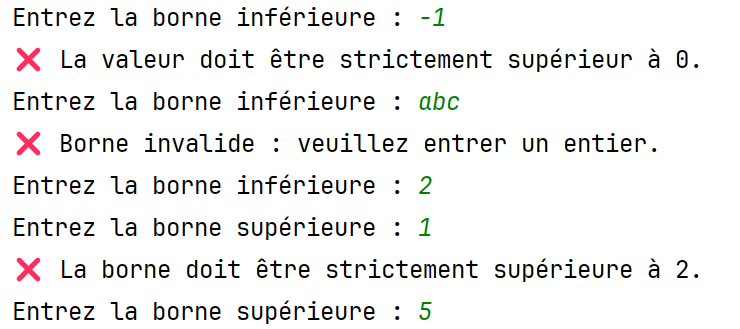

# Travail Pratique 2: Analyse d'un intervalle de nombres

### Objectifs
- Comprendre et appliquer les opérations arithmétiques (chapitre 1)
- Utiliser les sous-programmes (chapitre 3)
- Manipuler les structures conditionnelles (chapitre 4)
- Maîtriser les boucles for et while (chapitres 5 et 6)
- Combiner les structures de contrôle (chapitre 7) 

### Pondération
15 % de la note finale.

### Évaluation
- Chaque partie sera évaluée sur 10 points selon les critères suivants:
  - Respect des consignes
  - Exactitude des calculs
  - Qualité du code (noms de variables, commentaires, structure)

### Équipes
Travail à faire en équipe de 2 ou 3. Aucun travail individuel n’est accepté. **Un travail solo ne sera pas  
corrigé et se verra attribuer la note de 0.**

### Remise
Le travail doit être remis via GitHub Classroom; les remises par LÉA ne sont pas acceptées. La date de remise sera  
communiquée par LÉA et sera aussi inscrite dans Github Classroom.

À noter que l'utilisation de Git permet de faire des remises partielles au fur et à mesure de l'avancement du travail.

# Travail à faire
### Contexte
Dans ce travail pratique, vous devez concevoir un programme capable d’analyser les nombres entiers contenus dans une plage définie par l’utilisateur. 
L’objectif est double :
- Identifier les nombres parfaits : des entiers dont la somme des diviseurs propres (excluant le nombre lui-même) est égale au nombre. 
- Détecter les couples amicaux : deux entiers distincts tels que la somme des diviseurs propres de chacun correspond à l’autre. 

Ce TP vise à développer la capacité à :
- Décomposer un problème algorithmique en étapes claires. 
- Manipuler des boucles et des fonctions pour explorer des propriétés mathématiques. 
- Valider les entrées et structurer les résultats de manière lisible.

L’analyse portera sur tous les entiers compris dans l’intervalle fourni par l’utilisateur, incluant les bornes. Le programme devra afficher :
- La liste des nombres parfaits détectés.
- La liste des couples amicaux présents dans la plage, sans doublons ni permutations inutiles.

### Prérequis
- Cloner le répertoire de Git hub classroom sur PyCharm (voir le document Git sur Léa au besoin)
- Votre code doit être dans le fichier `simulation.py` qui vous est fourni votre dépôt généré par Github Classroom.
- Inscrire le nom des membres de l'équipe, no de DA et nom d'utilisateur github dans l'espace prévu à cet effet dans le fichier `simulation.py`.

## Partie 1: Définir l'intervalle de recherche(10 points)
### Objectifs
Vous devez demander à l'utilisateur de définir la borne inférieur et la borne supérieur de l'intervalle de recherche.
Vous devez respecter les critères suivants:
- Les bornes doivent être des entiers
- La borne inférieure doit être plus grande que 0
- La borne supérieure doit être plus grande que la borne supérieure

**Tant que les critères ne sont pas respectés, on doit indiquer l'erreur à l'utilisateur et redemander d'entrer la borne.**
### Fonctions à générer
- `demander_borne_inferieur()`: demande à l'utilisateur d'entrer la borne inférieure entière et strictement positive.
La fonction repose la question en cas d'erreur et affiche l'erreur. 
Elle doit retourner la borne valide.
- `demander_borne_superieur(...)`: demande à l'utilisateur d'entrer la borne supérieure entière et splus grande que la borne inférieure. 
La fonction prend en paramètre la borne inférieure
La fonction repose la question en cas d'erreur et affiche l'erreur. 
Elle doit retourner la borne valide.
- Le code pour afficher ❌ est \u274C

### Affichage
Voici le dialogue attendu entre l'utilisateur et le code :

## Partie 2 : Nombres parfaits (10 points)

### Objectifs
Vous devez identifier tous les nombres parfaits qui se trouvent dans un intervalle donné.
Un nombre parfait est un nombre qui est égale à la somme de ses diviseurs. Voici les concepts clés :
- diviseur : **p** est un diviseur de **n** si celui-ci divise **n** sans reste.
- nombre parfait : **n** est un nombre parfait si la somme de ses diviseurs **s(n)** est égale à lui-même.
  - s(n) = n

**Exemple :** 6 est un nombre parfait, car la somme de ses diviseurs (1+2+3) est égale à lui-même (6).

**Note :** Entre 1 et 1500, les 3 nombres parfaits sont 6, 28 et 496

### Fonctions à générer
- `somme_diviseurs(...)`: prends en paramètre un nombre et retourne la somme de ses diviseurs.
- `est_parfait(...)`: prend en paramètre un nombre et retourne vrai si le nombre est parfait, retoune faux dans le cas contraire.
- `afficher_nombres_parfaits(...)`: prend en paramètre un intervalle et affiche tous les nombres parfaits compris dans cet intervalle inclusivement.
Elle doit faire appel à est_parfait pour vérifier si un nombre est parfait.

### Affichage

Voici le résultat attendu lors de l'appel de `afficher_nombres_parfaits` :

## Partie 3 : Couples amicaux (10 points)

### Objectifs
Vous devez identifier tous les couples amicaux qui se trouvent dans un intervalle donné.
Un couple amical correspond à 2 nombres pour lesquelles la somme de leurs diviseurs est égale à l'autre nombre.
Voici les concepts clés :
- couple amical : **a** et **b** sont u couple parfait si la somme des diviseurs de a **s(a)** est égale à **b** ET que la somme des diviseurs de b **s(b)** est égale à **a**.
  - s(a) = b ET s(b) = a

**Exemple :** 220 et 284 sont un couple amical, car la somme des diviseurs de **220** (1 + 2 + 4 + 5 + 10 + 11 + 20 + 22 + 44 + 55 + 110) est égale à **284** ET 
la somme des diviseurs de **284** (1 + 2 + 4 + 71 + 142) est égale à **220**.

**Note :** Entre 1 et 1500, les 2 couples amicaux sont (220 et 284) et (1184 et 1210)

### Fonctions à générer
- `sont_amicaux(...)`: prend en paramètre deux nombres et retourne vrai s'ils forment un couple amical. Sinon, elle retourne faux.
- `afficher_couples_amicaux(...)`: prend en paramètre un intervalle et affiche tous les couples amicaux compris dans cet intervalle inclusivement.
Elle doit faire appel à sont_amicaux pour vérifier si deux nombres forment un couple amical.

### Affichage

Voici le résultat attendu lors de l'appel de `afficher_couples_amicaux` :

